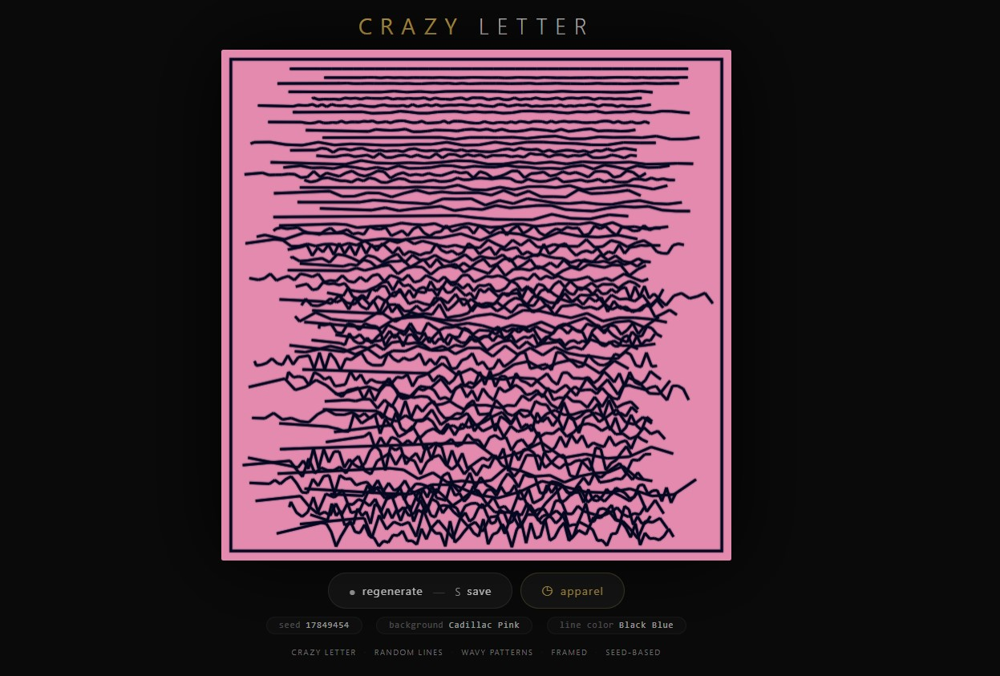
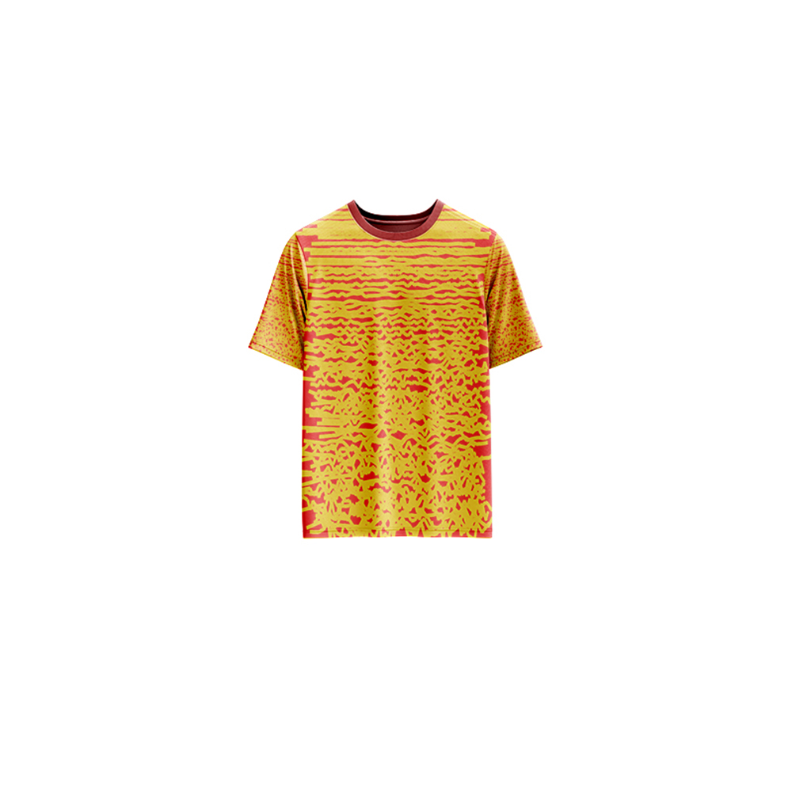

# Crazy Letter — Generative Art

[](https://reyrove.github.io/Crazy-Letter-Generative-Art)
[](https://opensource.org/licenses/MIT)

> **Generative wavy line art.** Each refresh creates a unique framed composition of organic, flowing lines with random colors and wavy patterns.

## 🎨 Live Demo

<div align="center">
  <a href="https://reyrove.github.io/Crazy-Letter-Generative-Art" target="_blank">
    
  </a>
  <br><br>
  <a href="https://reyrove.github.io/Crazy-Letter-Generative-Art" target="_blank">
    
  </a>
  <br>
  <em>Click the image or button to experience the generative art</em>
</div>

## 👕 Apparel Preview

<div align="center">
  
  <br>
  <em>Crazy Letter artwork printed on a T-shirt</em>
</div>

## ✨ Features

- **Wavy Line Patterns** — Organic, flowing lines with random variations
- **Framed Composition** — Elegant rectangular frame around the artwork
- **Rich Color Palettes** — 56 background colors + 55 foreground colors
- **Glow Effect** — Soft shadow glow on lines
- **Seed-Based** — Every composition is unique and reproducible via its seed
- **Save & Share** — Download as PNG with seed in filename
- **Apparel Mode** — Preview artwork on a T-shirt mockup
- **Responsive** — Works on desktop, tablet, and mobile
- **Pure JavaScript** — No external dependencies
- **Keyboard Shortcuts**:
  - `R` — Regenerate
  - `S` — Save image
  - `T` — Toggle apparel view

## 🎨 Artwork Details

| Parameter | Range | Description |
|-----------|-------|-------------|
| **Background Colors** | 56 options | Soft pastel and vibrant backgrounds |
| **Foreground Colors** | 55 options | Dark and rich line colors |
| **Line Width** | Variable | Scales with canvas size |
| **Line Spacing** | Variable | Random spacing between lines |
| **Waviness** | Variable | Random wave amplitude |
| **Margin** | Variable | Random frame margin size |

## 🎯 How It Works

The artwork creates a framed composition with flowing, wavy lines:

1. **Setup**:
   - Random background color from 56 soft colors
   - Random line color from 55 dark colors
   - Random margin size
   - Random line spacing and waviness

2. **Frame**:
   - Rectangular border with random margin
   - Creates a contained composition

3. **Lines**:
   - Horizontal lines with random vertical spacing
   - Each line has a wavy pattern
   - Wave amplitude varies along the line
   - Lines don't touch the frame edges

## 🚀 Quick Start

### Local Development

```bash
# Clone the repository
git clone https://github.com/reyrove/Crazy-Letter-Generative-Art.git

# Navigate to the directory
cd Crazy-Letter-Generative-Art

# Open in browser
open index.html
# or use a live server
```

### Deploy to GitHub Pages

1. Push to GitHub
2. Go to Settings → Pages
3. Select branch `main` and root folder
4. Your site will be live at `https://reyrove.github.io/Crazy-Letter-Generative-Art`

## 🧠 How It Works

The artwork is generated using a deterministic random number generator, seeded by timestamp + random noise. Every refresh:

1. **Setup**:
   - Random background color from 56 options (pastels, whites, soft colors)
   - Random line color from 55 options (dark colors)
   - Random margin size
   - Random line width and spacing

2. **Frame Rendering**:
   - Rectangular border with glow effect
   - Margins create a clean, contained composition

3. **Line Generation**:
   - Horizontal lines drawn from left to right
   - Each line has a wavy pattern with random amplitude
   - Lines have random spacing between them
   - Lines start and end with variations

4. **Rendering**:
   - All elements drawn on canvas
   - Glow effect on lines for depth
   - Clean, minimalist aesthetic

## 📁 File Structure

```
Crazy-Letter-Generative-Art/
├── index.html          # Main application (all-in-one)
├── Crazy-Letter.jpg    # T-shirt mockup image
├── fav.svg             # Favicon
├── demo-screenshot.jpg # Website demo screenshot
├── README.md           # This file
└── LICENSE             # MIT License
```

## 🛠️ Tech Stack

- **Pure Vanilla HTML/CSS/JS** — No dependencies
- **Canvas API** — 2D rendering
- **CSS Flexbox/Grid** — Responsive layout
- **GitHub Pages** — Hosting

## 🎯 Interactive Controls

| Action | Keyboard | Button |
|--------|----------|--------|
| Regenerate | `R` | Click "regenerate" |
| Save Image | `S` | Click "regenerate" |
| Toggle Apparel | `T` | Click "apparel" |

## 🎨 The Creative Process

### Color Palettes
The artwork features a wide range of color combinations:
- **Backgrounds**: 56 soft, pastel, and vibrant colors
- **Lines**: 55 dark, rich colors for contrast

### Wavy Lines
Each line is generated with a wave-like pattern:
- Amplitude varies randomly along the line
- Creates organic, flowing patterns
- No two lines are identical

### Framed Composition
The rectangular frame creates a contained, balanced composition:
- Random margin size
- Lines stay within the frame
- Clean, structured aesthetic

### Glow Effect
A subtle shadow glow on the lines adds depth and dimension to the artwork.

## 📱 Responsive Design

The application automatically adapts to:
- Desktop screens
- Tablets
- Mobile phones
- Landscape orientation
- Various aspect ratios

## 🤝 Contributing

Contributions are welcome! Feel free to:
- Fork the repository
- Create a feature branch
- Submit a pull request

### Ideas for Contributions:
- New color palettes
- Different line patterns
- Additional frame styles
- Animation features
- Performance optimizations

## 📄 License

MIT License — see [LICENSE](LICENSE) file for details.

## 🙏 Acknowledgments

- Inspired by letterpress and line art
- Pure JavaScript implementation
- Special thanks to the creative coding community

---

**Built with ❤️ and crazy letters**